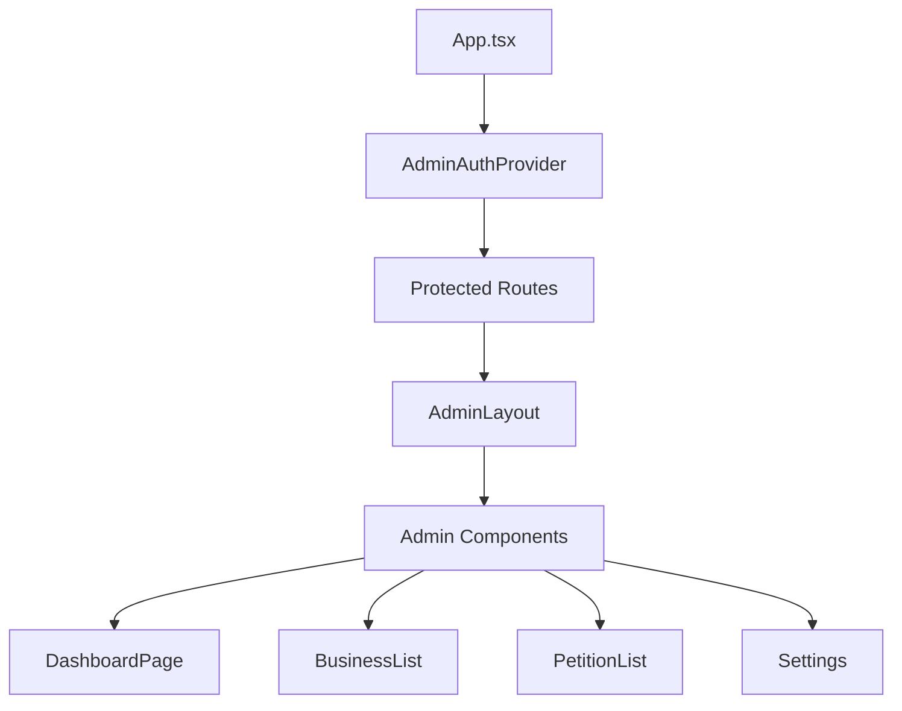
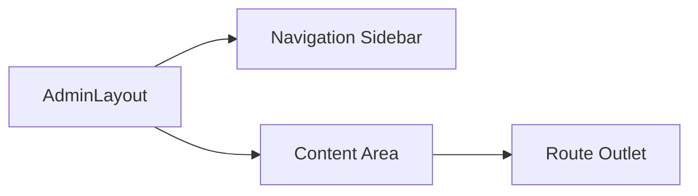
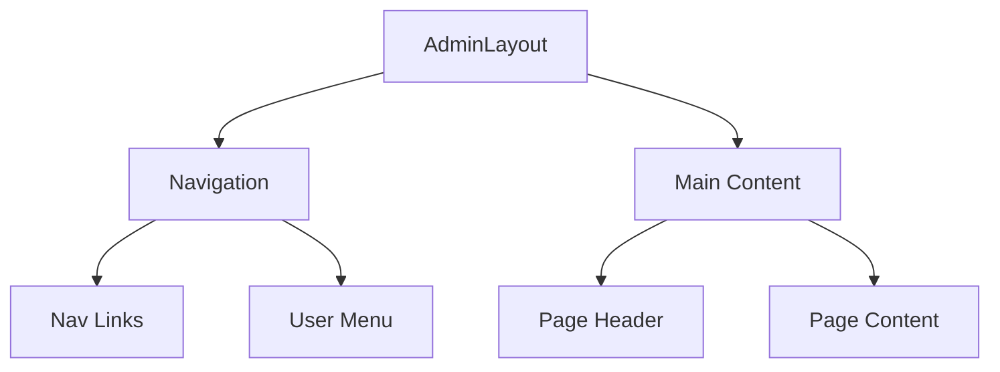
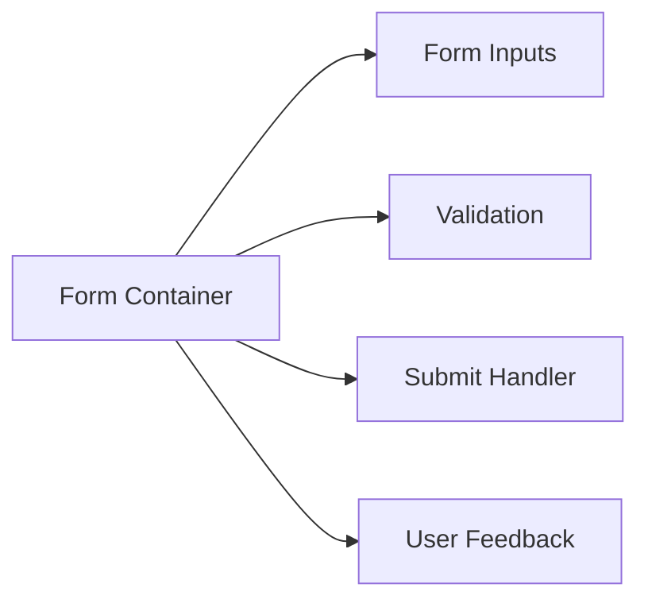

# System Patterns: LocalWebsiteAudit.ca Admin Panel

## Architecture Overview

### Frontend Architecture

## Key Design Patterns

### 1. Authentication Pattern
- Supabase Auth integration
- Protected route wrapper
- Session management
- Password reset flow

### 2. Layout Pattern

### 3. Data Management
- React Query for server state
- Supabase real-time subscriptions
- Optimistic updates
- Error boundary handling

### 4. Component Architecture
- Shared UI components (shadcn/ui)
- Form management patterns
- Modal/dialog patterns
- Toast notifications

## Technical Decisions

### State Management
- React Query for server state
- React Context for auth state
- Local state for UI components

### Routing Structure
- Nested routes for admin section
- Protected route wrapper
- Dynamic route parameters

### Form Handling
- React Hook Form
- Zod validation
- File upload management

### API Integration
- Supabase client
- TypeScript types
- Error handling patterns

## Component Relationships

### Admin Layout

### Form Components
