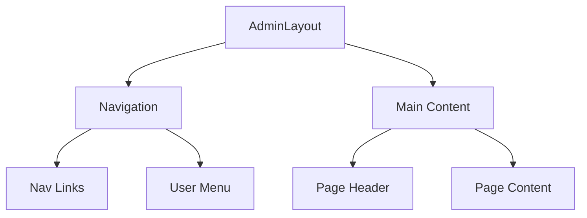
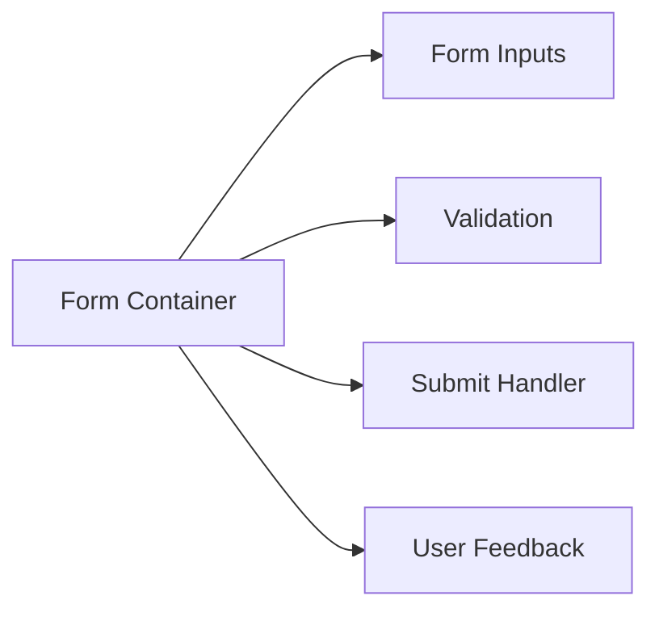
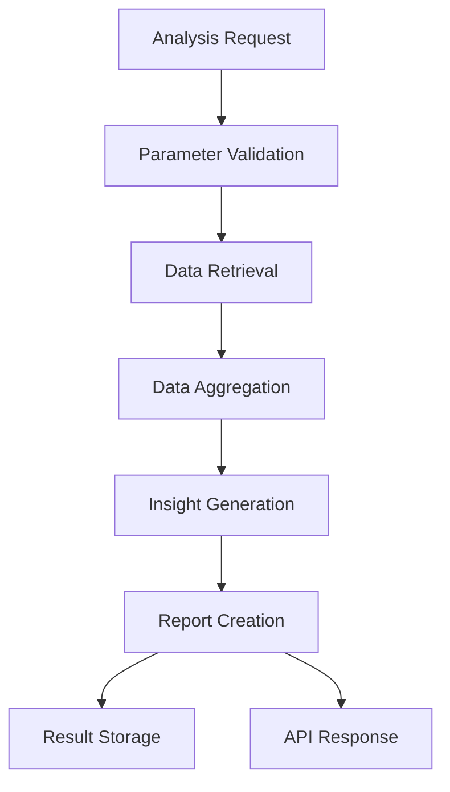
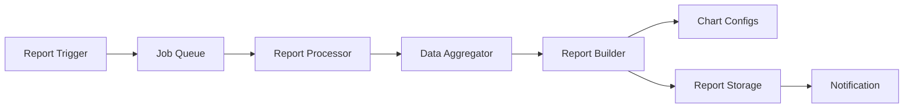

# System Patterns: LocalWebsiteAudit.ca Admin Panel

## Architecture Overview

### Frontend Architecture
```
┌─ App
├─── AdminLayout
│    ├─── Sidebar Navigation
│    └─── Main Content Area
│         ├─── Dashboard
│         ├─── Business Management
│         ├─── Scraper Control Panel
│         ├─── Analytics Dashboard
│         └─── Petition Management
└─── Auth Wrapper
```

### Scraper Architecture
```
┌─ Scraper Control Panel (UI)
├─── Job Management
│    ├─── Queue Control
│    ├─── Status Monitoring
│    └─── Error Handling
│
├─ Business Discovery Service
│    ├─── Geographic Grid System
│    ├─── API Integration Layer
│    │    ├─── Google Places
│    │    ├─── Yelp
│    │    └─── Yellow Pages
│    └─── Data Normalization
│
├─ Website Audit Service
│    ├─── URL Validation
│    ├─── Lighthouse Testing
│    ├─── Screenshot Capture
│    ├─── Tech Detection
│    └─── Score Calculator
│
└─ Data Pipeline
     ├─── Job Queue
     ├─── Rate Limiter
     ├─── Error Recovery
     └─── Results Processing
```

### Data Analysis Architecture
```
┌─ Analysis Service
├─── Data Aggregators
│    ├─── Geographic Insights
│    │    ├─── Business Density Calculator
│    │    ├─── Performance Heatmap Generator
│    │    └─── Regional Metrics Analyzer
│    │
│    ├─── Category Analysis
│    │    ├─── Industry Benchmarker
│    │    ├─── Improvement Area Detector
│    │    └─── Category Ranker
│    │
│    └─── Business Comparison
│         ├─── Competitive Ranker
│         ├─── Strength/Weakness Analyzer
│         └─── Historical Trend Tracker
│
├─── Report Generation
│    ├─── Report Builder
│    ├─── Chart Configuration
│    ├─── Data Formatter
│    └─── Template Engine
│
├─── Processing System
│    ├─── Job Queue
│    ├─── Scheduled Tasks
│    ├─── Progress Tracking
│    └─── Error Recovery
│
└─── API Layer
     ├─── Report Endpoints
     ├─── Analysis Requests
     ├─── Status Monitoring
     └─── Webhook Integration
```

## Key Design Patterns

### Authentication Pattern
- Supabase Auth integration
- Protected route wrapper
- Session management
- Role-based access

### Layout Pattern
- Persistent sidebar
- Responsive design
- Content area management
- Toast notifications

### Data Management Pattern
- TanStack Query for caching
- Optimistic updates
- Real-time sync
- Error boundaries

### Scraper Patterns
1. Geographic Grid Pattern
   - Area subdivision
   - Coverage tracking
   - Overlap handling

2. Job Queue Pattern
   - Distributed processing
   - Priority queuing
   - Retry mechanism
   - Rate limiting

3. Data Collection Pattern
   - Source abstraction
   - Normalization pipeline
   - Deduplication
   - Validation

4. Audit Pipeline Pattern
   - Sequential processing
   - Parallel execution
   - Error recovery
   - Result aggregation

### Analysis Patterns
1. Aggregator Pattern
   - Specialized modules for different analysis types
   - Data filtering and transformation
   - Statistical calculation
   - Insight extraction

2. Report Generation Pattern
   - Standardized report structure
   - Customizable parameters
   - Chart configuration
   - Template-based formatting

3. Scheduled Processing Pattern
   - Cron-based scheduling
   - Automatic report generation
   - Event-driven updates
   - Batch processing

4. Comparative Analysis Pattern
   - Benchmark calculation
   - Relative scoring
   - Trend identification
   - Ranking system

## Technical Decisions

### State Management
- React Query for server state
- Context for UI state
- Local storage for preferences

### Routing Structure
- Nested routes
- Protected routes
- Dynamic parameters
- History management

### API Integration
- Axios instances
- Request interceptors
- Error handling
- Rate limiting

### Job Processing
- Bull queue system
- Redis backend
- Worker processes
- Monitoring hooks

### Error Handling
- Global error boundary
- Service-level recovery
- User feedback
- Logging system

### Geographic Analysis
- Turf.js for spatial calculations
- Grid-based density analysis
- Heatmap generation
- Polygon-based regional analysis

### Report Visualization
- Chart configuration objects
- Unified data format
- Customizable parameters
- Theme consistency

## Data Flow

### Business Discovery Flow
1. Grid area selection
2. API query execution
3. Data normalization
4. Deduplication check
5. Storage in raw data
6. Queue website audit

### Website Audit Flow
1. URL validation
2. Lighthouse testing
3. Screenshot capture
4. Tech stack detection
5. Score calculation
6. Results storage

### Data Analysis Flow
1. Data aggregation request
2. Parameter validation
3. Data retrieval from database
4. Processing through aggregators
5. Insight generation
6. Report formatting
7. Storage in analysis tables

### Report Generation Flow
1. Report request (manual or scheduled)
2. Job creation in queue
3. Parameter processing
4. Data aggregation execution
5. Report structure creation
6. Chart configuration generation
7. Storage in report table
8. Notification of completion

### User Interaction Flow
1. Action initiation
2. Optimistic update
3. Backend validation
4. Success/error feedback
5. State synchronization

## Component Relationships

### Admin Layout


### Form Components


### Analysis Flow


### Report Generation System
