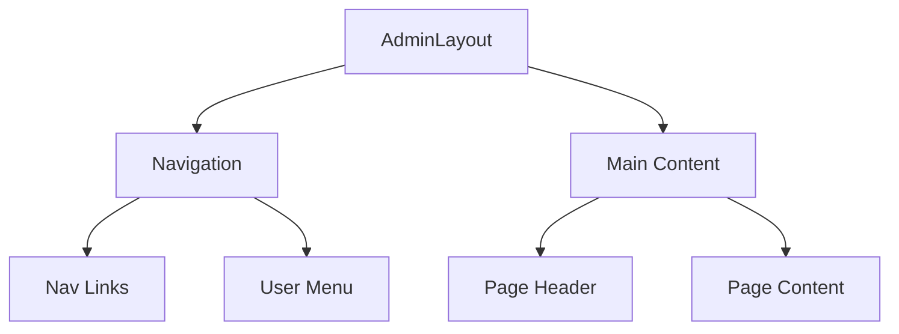
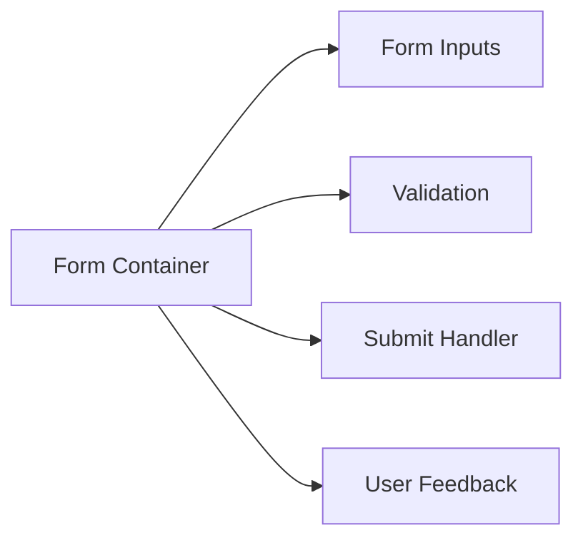

# System Patterns: LocalWebsiteAudit.ca Admin Panel

## Architecture Overview

### Frontend Architecture
```
┌─ App
├─── AdminLayout
│    ├─── Sidebar Navigation
│    └─── Main Content Area
│         ├─── Dashboard
│         ├─── Business Management
│         ├─── Scraper Control Panel
│         └─── Petition Management
└─── Auth Wrapper
```

### Scraper Architecture
```
┌─ Scraper Control Panel (UI)
├─── Job Management
│    ├─── Queue Control
│    ├─── Status Monitoring
│    └─── Error Handling
│
├─ Business Discovery Service
│    ├─── Geographic Grid System
│    ├─── API Integration Layer
│    │    ├─── Google Places
│    │    ├─── Yelp
│    │    └─── Yellow Pages
│    └─── Data Normalization
│
├─ Website Audit Service
│    ├─── URL Validation
│    ├─── Lighthouse Testing
│    ├─── Screenshot Capture
│    ├─── Tech Detection
│    └─── Score Calculator
│
└─ Data Pipeline
     ├─── Job Queue
     ├─── Rate Limiter
     ├─── Error Recovery
     └─── Results Processing
```

## Key Design Patterns

### Authentication Pattern
- Supabase Auth integration
- Protected route wrapper
- Session management
- Role-based access

### Layout Pattern
- Persistent sidebar
- Responsive design
- Content area management
- Toast notifications

### Data Management Pattern
- TanStack Query for caching
- Optimistic updates
- Real-time sync
- Error boundaries

### Scraper Patterns
1. Geographic Grid Pattern
   - Area subdivision
   - Coverage tracking
   - Overlap handling

2. Job Queue Pattern
   - Distributed processing
   - Priority queuing
   - Retry mechanism
   - Rate limiting

3. Data Collection Pattern
   - Source abstraction
   - Normalization pipeline
   - Deduplication
   - Validation

4. Audit Pipeline Pattern
   - Sequential processing
   - Parallel execution
   - Error recovery
   - Result aggregation

## Technical Decisions

### State Management
- React Query for server state
- Context for UI state
- Local storage for preferences

### Routing Structure
- Nested routes
- Protected routes
- Dynamic parameters
- History management

### API Integration
- Axios instances
- Request interceptors
- Error handling
- Rate limiting

### Job Processing
- Bull queue system
- Redis backend
- Worker processes
- Monitoring hooks

### Error Handling
- Global error boundary
- Service-level recovery
- User feedback
- Logging system

## Data Flow

### Business Discovery Flow
1. Grid area selection
2. API query execution
3. Data normalization
4. Deduplication check
5. Storage in raw data
6. Queue website audit

### Website Audit Flow
1. URL validation
2. Lighthouse testing
3. Screenshot capture
4. Tech stack detection
5. Score calculation
6. Results storage

### User Interaction Flow
1. Action initiation
2. Optimistic update
3. Backend validation
4. Success/error feedback
5. State synchronization

## Component Relationships

### Admin Layout


### Form Components
